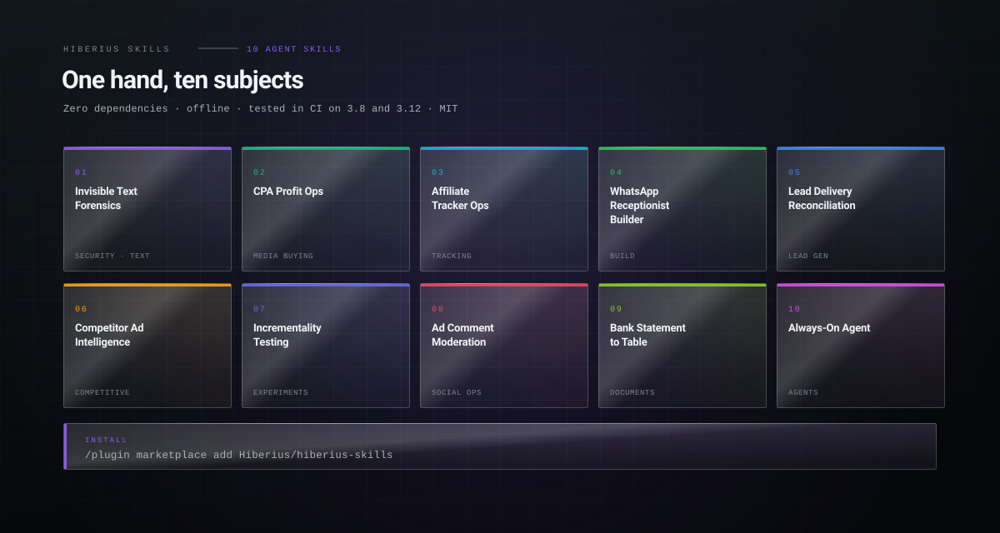

  <picture>
    <source media="(prefers-color-scheme: dark)" srcset="assets/family-dark.svg">
    <source media="(prefers-color-scheme: light)" srcset="assets/family-light.svg">
    
  </picture>

<h1 align="center">Hiberius Skills</h1>

<b>Ten Agent Skills from fifteen years of buying traffic and building the
systems around it. Zero dependencies, offline, a working CLI and a real test suite in every
one, and each encodes something you cannot get from documentation.</b>

  
  
  
  
  

  <code>/plugin marketplace add Hiberius/hiberius-skills</code>

  Or one at a time: <code>npx skills add Hiberius/&lt;skill&gt;</code>. Works with Claude
  Code, Claude Desktop, Codex, Cursor, Windsurf, OpenClaw and anything else that reads a
  <code>SKILL.md</code>.

---

## Performance marketing

| Skill | What it knows that the docs do not |
|---|---|
| **[cpa-profit-ops](https://github.com/Hiberius/cpa-profit-ops)** | `profit = leads × payout(country) − spend`, computed inside one currency. Blended CPL hides the losing geo inside the winning account, so triage is per country, never averaged. |
| **[affiliate-tracker-ops](https://github.com/Hiberius/affiliate-tracker-ops)** | A conversion that does not attribute is a broken parameter chain, not a tracker bug. Follows the click id **by value** across ad, lander, offer and postback, so it survives the parameter being renamed at every hop. |
| **[lead-delivery-reconciliation](https://github.com/Hiberius/lead-delivery-reconciliation)** | "Received" is a format check, not money. A lead you rejected locally can still have been accepted and paid, and left unrealigned that payout sits on a rejected row for a month before anyone notices. |
| **[competitor-ad-intelligence](https://github.com/Hiberius/competitor-ad-intelligence)** | Nobody publishes competitor spend, so score what a losing ad cannot fake. Group re-uploads first: an advertiser rotating creatives every fortnight looks like three short tests and is one concept that has run for six weeks. |
| **[incrementality-testing](https://github.com/Hiberius/incrementality-testing)** | Checking a fixed-horizon p-value daily pushes the false positive rate to about 30%. An always-valid sequential test fixes it, and the test suite proves it with twenty peeks under a true null. |
| **[ad-comment-moderation](https://github.com/Hiberius/ad-comment-moderation)** | Comments on your ad live on the page post behind the creative, which for a dark post never appears on your page. And allow rules must run first, or an allow list is not an allow list. |

## Security and text

| Skill | What it knows that the docs do not |
|---|---|
| **[invisible-text-forensics](https://github.com/Hiberius/invisible-text-forensics)** | Every humanizer rewrites style; none read the bytes. Zero-width watermarks, tag-character prompt injection and bidi overrides survive copy, paste and git. And ZWJ inside an emoji or an Arabic word must **not** be stripped, which every naive cleaner gets wrong. |
| **[always-on-agent](https://github.com/Hiberius/always-on-agent)** | The first pass on your machine must be incapable of harm: it reads the key **name** and discards the value before returning anything, with a canary asserted in the tests. |

## Everything else

| Skill | What it knows that the docs do not |
|---|---|
| **[whatsapp-receptionist-builder](https://github.com/Hiberius/whatsapp-receptionist-builder)** | The signature is over the raw body, so parsing before verifying looks exactly like a wrong secret. The 24-hour window closes on the customer's last message, not yours. Double booking is a race only the database can refuse. |
| **[bank-statement-to-table](https://github.com/Hiberius/bank-statement-to-table)** | A statement carries its own proof. Every balance equals the previous plus the movement, so an extraction is either verified or wrong, and the difference tells you which row. |

---

## Why these ten

Each one comes out of a production system that had to survive contact with money: a
multi-account Meta command centre, a lead bridge reconciling payouts hourly, an
open-source WhatsApp receptionist, a competitor ad archive, a Facebook comment moderator,
an incrementality platform.

What they encode is not the documentation. It is the part you only learn by getting it
wrong once with a real budget: that a postal code must stay a string end to end, that a
daily cap is consumed on the sent date and not the received one, that a re-upload resets
an ad's clock, that peeking at a p-value is not free.

## The shape they share

Every skill in this set:

- **zero dependencies**, Python 3.8+, standard library only
- **no network calls**, no telemetry, nothing uploaded
- a **working CLI** with real output, not pseudocode
- a **test suite** that runs in CI on 3.8 and 3.12
- **references** carrying the depth, so the `SKILL.md` stays readable
- **MIT**

## The look

Every banner and every internals diagram in this set is drawn by one script,
[`brand/gen.py`](brand/gen.py), which is why ten repositories look like one hand. The
structure is brutalist: an exposed grid, hard corners, hairline rules, registration marks,
monospace labels. The surfaces are glass: layered translucent panels with a specular sweep
and one accent glow. Each skill varies exactly one thing, its accent hue, plus a signature
motif drawn from its own subject.

No external font, no script, no remote asset: GitHub sanitises SVG and refuses anything
else, so the whole system is geometry and type.

## Work with me

I build the systems these skills came out of: performance marketing infrastructure, lead
pipelines, ad account tooling, internal automation, and products on the Cloudflare edge
stack. If you need something like this built properly, I take on freelance and contract
work.

**[Christian Calabro — github.com/Hiberius](https://github.com/Hiberius)**

Performance marketing · media buying · TypeScript · Cloudflare Workers · Next.js · Python

## License

MIT, all of them.
